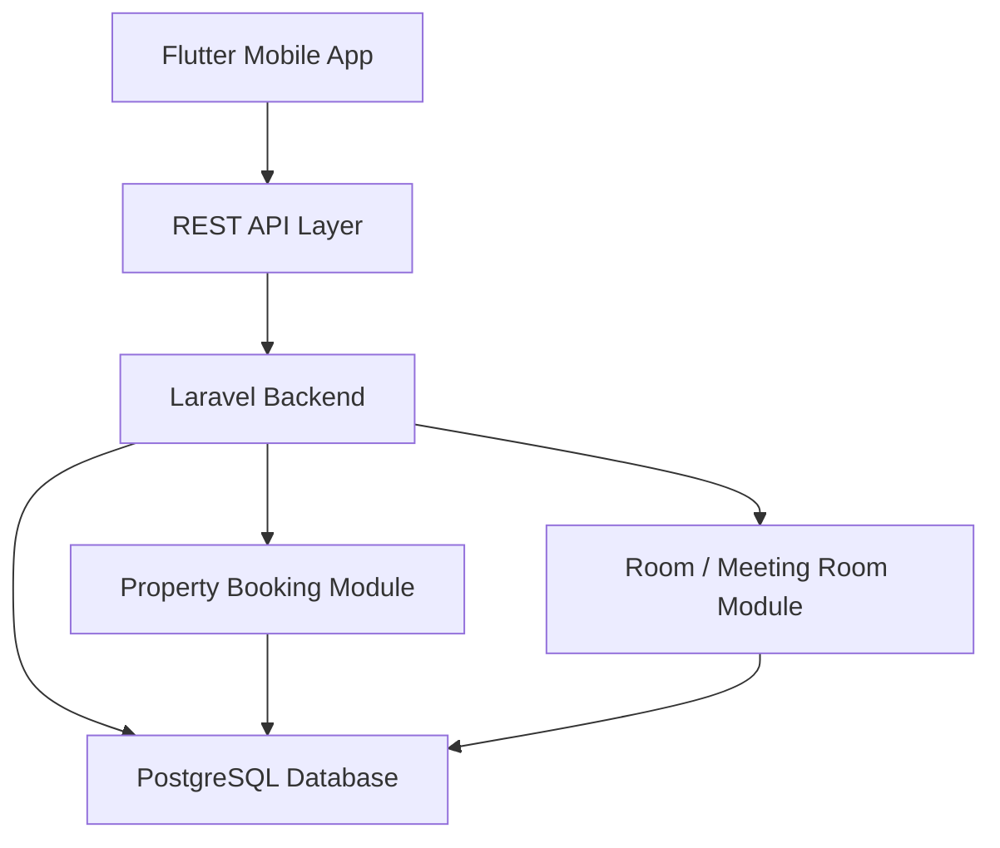

# System Architecture Diagram

**Components:**
- Flutter Mobile App: Client interface for Admin users
- REST API Layer: Handles HTTP requests/responses
- Laravel Backend: Business logic and API implementation
- PostgreSQL Database: Data storage
- Property Booking Module: Booking management
- Room / Meeting Room Module: Room management

**Flow:**
1. Admin interacts with Flutter app
2. App sends HTTP requests to REST API
3. Laravel processes requests, applies business logic
4. Data is stored/retrieved from PostgreSQL
5. Property Booking and Room modules interact with database
